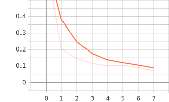

# Phone Finder

This project provides a model trainer to predict the location (coordinates) of a phone in a given 
image or a path to a directory of images. 
 
### Prerequisites and setup

**Please run this project from the root of the project directory**.
Command line arguments **can be absolute**.
From the root of this project directory structure, run the `setup.py` script as 
```
python setup.py
```
to install all the project dependencies. This script installs Mask R-CNN package, 
which is the backbone of this entire project. Mask R-CNN package is installed directly from Git source
repository as its PyPI version is not updated with the latest changes. Hence it is buggy. 
Besides Mask R-CNN, there are other packages that are required and are installed from the `requirements.txt`

### Initializing

The main runnable files in this project are `train_phone_finder.py`, for training the phone finder 
model and `find_phone.py` is the phone localization module.

Although you will not need to change anything as this will run smoothly out of the box,
the program is highly configurable via the `./config/params.json` file. You can configure the locations of
training checkpoint models, hyperparameters like number of epochs and number of steps 
in each epoch, learning rate, layers to trains and exclude. You can also disable logging in trainer
and finder module. Details about each param is listed below 


```
{
    "training_model_path": "<checkpoint path for the model being trained>",
    "trained_weights_file_path": "<Pre-trained COCO weights file for training on top of that and for Prediction>",
    "class_config_name": "<configuration name for the class being identified>",
    "number_of_epoch_steps": <number of steps in each epoch>,
    "number_of_epochs": <number of epochs>,
    "learning_rate": <learning rate to train with. Default is 0.001>,
    "layers": "<layers to train. Default is 'all'>",
    "layers_to_exclude_while_training": ["<List of strings specifying the layers in the pre-trained weights to exlude from training>"],
    "number_of_classes": <Number of classes to detect. Here, its phone and the background (BG is always present)>,
    "bbox_x_offset": <Horizontal offset used to create bounding box around the phone using the annotated center of phone>,,
    "bbox_y_offset": <Vertical offset used to create bounding box around the phone using the annotated center of phone>,
    "test_size": <Test split from the dataset. Train split is calculated accordingly>,
    "random_seed": <Random seed for shuffling dataset>,
    "disable_find_phone_logging": <Boolean value as false or true. true for disable logging>,
    "disable_trainer_logging": <Boolean value as false or true. true for disable logging>,
    "disable_error_reporting": <Boolean value as false or true. true for disable logging>,
    "predicted_radius": <Radius of the small cirle drawn on image while displaying predicted center of phone>
}
```

## Training the model

Tune the hyperparameters from `./config/params.json` and run `train_phone_finder.py` with path to 
image data set directory with the `labels.txt` inside the path as

```
python train_phone_finder.py ./images
```

## How does this stuff work

This Mask R-CNN model is trained by utilizing the concept of **transfer learning**. We take pre-trained model weights on 
COCO (**C**ommon **O**bjects in **CO**ntext) object detection dataset and tailor it to fit our specific dataset i.e. 
images of phones. While loading the COCO weights, we remove the pre-trained class specific output layers so 
that new output layers can be defined and trained. Doing this prevents overfitting. This is done by 
specifying the `exclude` argument and listing all of the output layers to exclude or remove from the model
after it is loaded at this line
 ```
model.load_weights(model_weights, by_name=True, exclude=PARAMS["layers_to_exclude_while_training"])
```
 The output layers for the classification label, bounding boxes, 
and masks can be excluded. This list of layers to exclude can be be specified in the `./config/params.json`.

After the weights are loaded, the new model can be trained on our dataset specifying the hyperparameters
```
model.train(trainset, testset, learning_rate=config.LEARNING_RATE, epochs=PARAMS['number_of_epochs'], layers=PARAMS["layers"])
```


##### **CAVEAT!**
Model training can take a long time if you're running without a significantly powerful GPU on the system.
Please train the model on a system with tensorflow-gpu<=1.15 installed, and a CUDA enabled 
graphic card with compute compatibility higher than 3.5. With the right configuration,
the model can be trained in 20-30 minutes (or even less. Depends on the number of epochs and steps per epoch). 
Otherwise, please be patient for up to 8 hours. 😀

If you cannot train a model, you can use the pickled model bundled with this program. I trained
this model on top of COCO weights to fit our phone localization model.
The epoch vs loss graph for this model with epoch on x-axis and loss on y-axis is



## Running the tests - Predictions

After the model is trained, the new model file path is automatically updated in the `./config/params.json`.
If the model training is interrupted in between the path to the new trained model is not updated in params.
In that case, please provide manually the path to the model file to be used for prediction.

Execute the `find_phone.py` with the path to image or directory of images to be predicted like 
```
python find_phone.py ./images/21.jpg
``` 
Detection of phone does not take as long as training does and is quite fast

